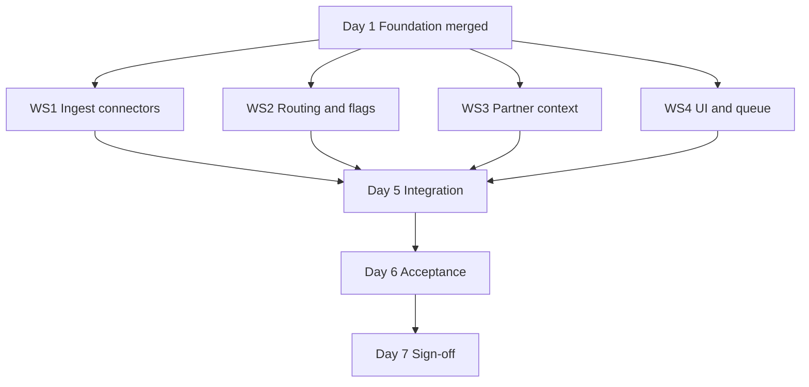

# M1.5 — Primary Military and Maritime Sources

**Milestone:** M1.5 — Primary Military and Maritime Sources  
**Document version:** 3.0 — Cursor-accelerated delivery  
**Date:** 9 July 2026  
**Status:** Proposal — pending owner sign-off  
**Calendar:** **7 days** (full M1.5 core scope)  
**Traditional estimate:** 21–27 dev-days → compressed via Cursor parallel workstreams  
**Precedes:** M2 — Stabilisation backlog  
**Follows:** M1 — Live baseline audit and locked priority order  
**Related:** M1 Audit Pack (`docs/M1-audit-pack.md`)

**Product rule (non-negotiable):** Sources may feed Watches, raise analyst flags, and support evidence packs. Sources must **not** automatically create Spot Reports. Spot Reports remain analyst-led from the Workbench.

---

## Executive summary

This plan delivers the **full original M1.5 core** (Phases 1–3) in **7 calendar days** using **Cursor** for parallel implementation. Scope is **not reduced** — the calendar is compressed by:

1. **Four parallel workstreams** after Day 1 foundation  
2. **Template cloning** from existing ingest modules (`iccPiracy.ts`, `reliefwebReports.ts`, Facebook OSINT queue)  
3. **Cursor Agent** for schema, API, tests, UI, and parser boilerplate  
4. **Fixture-first development** (saved HTML/PDF samples before live fetch)  
5. **Human gates** only where AI cannot substitute: live site validation, production smoke, owner acceptance  

| Package | Traditional | Calendar | Scope |
|---------|-------------|----------|--------|
| **M1.5 core** | 21–27 dev-days | **7 days** | Phases 1–3 (full spec below) |
| **M1.5 imagery add-on** | 10–14 dev-days | Later | Phase 4 — owner API keys required |

**Price:** **$2,400** (full M1.5 core — same as original proposal; calendar compression does not reduce deliverables)

---

## How 21–27 days fits in 7 days

| Factor | Traditional | Cursor-accelerated |
|--------|-------------|-------------------|
| Work style | Sequential phases | **4 parallel tracks** from Day 2 |
| Boilerplate | Hand-written schema, API, tests | **Agent-generated** from repo patterns |
| Connectors | One at a time | **UKMTO + CENTCOM + partners** in parallel |
| UI | After all ingest | **Watch panels + queue** alongside ingest Days 4–5 |
| Parser risk | Discover live early | **Fixtures first**, live validation Day 2–3 |
| Effective output | 1× dev-day per day | **~3–4×** on implementation; **1×** on verification |

**Honest constraint:** Cursor accelerates **writing code**, not **external dependencies**. Site IP blocks, PDF format quirks, and owner imagery keys still consume human time. Days 6–7 include buffer for this.

**Daily commitment assumed:** 8–10 focused hours with Cursor Agent; CI green each night.

---

## Milestone placement

| Order | Milestone | Calendar | Cost |
|-------|-----------|----------|------|
| — | M1 — Audit | Complete | $250 |
| **→** | **M1.5 — Military & maritime (full core)** | **7 days** | **$2,400** |
| | M2 — Stabilisation | 10–14 days | $1,000 |
| | M3–M6 | Per Phase 2 Proposal | — |
| Optional | M1.5 Phase 4 — Imagery | 10–14 days | $1,000 |

---

## Full scope — Phases 1–3 (unchanged)

### Phase 1 — Foundation, flags, and routing (Day 1)

| # | Deliverable |
|---|-------------|
| P1-D1 | Source group **Primary Military and Maritime Sources** in Source Health |
| P1-D2 | Five persisted analyst flags: Significant incident, Escalation indicator, Maritime disruption, Evidence available, Possible Spot Report |
| P1-D3 | Dual-watch routing — primary topic + `watch_tags` (or equivalent) |
| P1-D4 | Trigger-term classifiers (CENTCOM, UKMTO, partners) |
| P1-D5 | Spot Report guard — CI test; no ingest path writes `spot_reports` |
| P1-D6 | Routing rules engine (Section 6 matrix) |

### Phase 2 — CENTCOM and UKMTO live ingest (Days 2–4)

**CENTCOM:** releases index + detail; title, date, URL, body, images; region tags; categories; Conflict Watch default; Shipping when maritime terms match.

**UKMTO:** warnings, advisories, **PDF products**; all required fields; high confidence default; Shipping default; Conflict when escalation terms match; dedupe vs news echo.

**Watch integration:** Conflict panel (CENTCOM); Shipping panel (UKMTO); evidence URLs on items.

### Phase 3 — Partner products and analyst queue (Days 4–5)

**Partners:** JMIC, CMF, maritime advisory PDFs; context table; threat level; routing per content type.

**Analyst queue:** unified flag queue; Possible Spot Report → manual create with prefill only; flag KPIs.

### Phase 4 — Imagery (deferred)

Maxar / Planet — **not in 7-day window** (owner API keys + licence workflow). Priced separately at **$1,000**.

---

## Parallel workstreams (Days 2–5)

After Day 1 foundation merges, run four tracks in Cursor (separate Agent chats or Composer sessions per track):



| Workstream | Owner | Cursor clones from | Delivers by |
|------------|-------|-------------------|-------------|
| **WS1 — Connectors** | Dev + Agent | `iccPiracy.ts`, `feedFetch.ts` | Day 4 |
| **WS2 — Routing & flags** | Dev + Agent | `shippingAnalysis.ts`, `conflictAnalysis.ts`, `hormuzStatus.ts` | Day 3 |
| **WS3 — Partner context** | Dev + Agent | `reliefwebReports.ts`, PDF parser lib | Day 5 |
| **WS4 — UI & queue** | Dev + Agent | `Protests.tsx` Facebook queue, `Shipping.tsx`, Conflict monitor | Day 5 |

**Merge rule:** One PR per workstream per day; rebase on `main` each morning. Human resolves conflicts — do not let Agent merge blindly.

---

## 7-day execution plan

### Day 0 (before start — 2 hours, not counted)

| Task | Who | Cursor prompt hint |
|------|-----|-------------------|
| Save HTML fixtures | Human | Download UKMTO listing, 2 advisories, CENTCOM releases index, 2 releases → `__tests__/fixtures/m15/` |
| Save 1 partner PDF sample | Human | JMIC or CMF PDF if publicly available |
| Confirm prod URL access | Human | `curl` UKMTO + CENTCOM from Replit shell |
| Create branch `m15/foundation` | Human | — |

### Day 1 — Foundation (all tracks blocked until merged)

| Block | Cursor Agent task | Human gate |
|-------|-------------------|------------|
| AM | Schema: official sources table(s), `watch_tags`, analyst flags columns; Drizzle migration | Review migration |
| AM | Register source group in `integrationStatus.ts`, `maritimeSources.ts`, ingest runner hooks | — |
| PM | Routing rules module + trigger-term config JSON | Review term lists vs client spec |
| PM | Spot Report guard test; OpenAPI + Zod stubs for new endpoints | CI green |
| EOD | **Merge foundation** — unblocks WS1–WS4 | — |

**Day 1 Agent instruction (paste into Cursor):**

> Implement M1.5 Phase 1 foundation per `docs/primary-military-maritime-sources-phases.md`. Clone patterns from `iccPiracy.ts` and `socialRaw.ts` (reviewFlag). Add watch_tags, five analyst flags, routing rules engine, ingest runner registration, Spot Report guard test. Do not implement connectors yet.

### Day 2 — Connectors against fixtures

| WS1 | WS2 | Human |
|-----|-----|-------|
| `ukmtoIngest.ts` — listing + HTML detail parser using fixtures | Wire classifiers to routing engine | Validate parsers against **live** URLs; save updated fixtures if DOM differs |
| `centcomIngest.ts` — listing + detail parser using fixtures | Flag assignment functions at ingest | Run dry-run CLI |

**Day 2 Agent instruction (WS1):**

> Add `lib/ingest/src/ukmtoIngest.ts` and `centcomIngest.ts`. Use `feedFetch.ts` and `iccPiracy.ts` patterns. Parse fixtures in `__tests__/fixtures/m15/`. Extract all required fields from the M1.5 spec. Record Source Health. Never write to spot_reports.

### Day 3 — Persist, dedupe, live ingest

| WS1 | WS2 | WS4 (start) |
|-----|-----|-------------|
| UKMTO + CENTCOM commit mode; URL dedupe; news dedupe hook | Dual-watch tags on insert | Scaffold analyst queue page/panel (read-only list first) |
| PDF text extraction for UKMTO PDFs (if linked from HTML) | Tests with fixtures | — |
| Integration tests per connector | — | Human: manual `POST /api/admin/ingest` |

### Day 4 — Partner products + Watch panels

| WS3 | WS4 | WS1 |
|-----|-----|-----|
| `maritimePartnerProducts.ts` + context table | Shipping Watch — UKMTO official section | Image URL capture on CENTCOM releases |
| JMIC/CMF discovery + PDF summary extract | Conflict Watch — CENTCOM section | — |
| Threat level regex | Flag badges on watch items | — |

### Day 5 — Analyst queue + integration

| WS4 | All |
|-----|-----|
| Unified flag queue (filter by flag type) | Wire full ingest chain in `ingestRunner.ts` |
| Possible Spot Report → `/spot-reports/new?incidentId=` only | Partner context panels on watches |
| Flag KPIs | E2E: ingest → DB → API → UI |

**Human gate Day 5:** Walk Hormuz example — CENTCOM + UKMTO + partner item on correct watches.

### Day 6 — Acceptance and hardening

| Task | Who |
|------|-----|
| Run all M1.5-T1–T15 acceptance tests | Agent fixes failures in loop |
| Production smoke ingest | Human |
| Source Health truth table update | Agent drafts; human reviews |
| Bugfix only — **no new scope** | — |

### Day 7 — Sign-off

| Task | Who |
|------|-----|
| Owner acceptance walkthrough (or async video) | Human |
| Appendix C sign-off | Owner |
| Handoff note: known thin areas, Phase 4 imagery | Agent drafts |
| **M2 may start** | — |

---

## Cursor playbook

### What Cursor Agent should do

| Task type | Delegate to Agent |
|-----------|-------------------|
| New ingest module from template | Yes |
| Drizzle schema + migration | Yes |
| OpenAPI + route + Zod | Yes |
| Unit tests from fixtures | Yes |
| Watch UI panels (copy existing layout) | Yes |
| Analyst queue (clone Facebook OSINT panel) | Yes |
| Routing rules + flag assignment | Yes |
| CI failure triage | Yes |

### What the human must do

| Task | Why |
|------|-----|
| Save live HTML/PDF fixtures Day 0 | Agent cannot browse UKMTO/CENTCOM reliably |
| Live URL validation Day 2–3 | DOM and network truth |
| Production ingest smoke | Secrets, IP, scheduler |
| Review migrations & routing terms | Product correctness |
| Merge conflict resolution | Agent context limits |
| Owner demo / sign-off | Commercial acceptance |
| Whitelist Replit IP if blocked | External dependency |

### Recommended Cursor setup

| Setting | Recommendation |
|---------|----------------|
| Model | Default Agent model; use fast model for test-fix loops |
| Rules | Add `.cursor/rules/m15.mdc` pointing to this doc + Spot Report guard |
| Context | `@iccPiracy.ts` `@reliefwebReports.ts` `@facebookOsint.ts` in every ingest/queue task |
| Tests | Ask Agent to run `pnpm test` / targeted `jest` after each workstream |
| Parallelism | **Separate chat per workstream** — avoids context collision |

### Agent guardrails (add to every prompt)

```
M1.5 GUARDRAILS:
- Never insert into spot_reports from ingest
- Official sources must not inflate wrong incident counts (use dedicated tables where specified)
- Clone iccPiracy / reliefwebReports patterns for standalone storage
- recordSourceHealth on every connector
- Match existing repo conventions (pnpm, Drizzle, OpenAPI-first)
```

---

## Source group — full field spec

### CENTCOM

| Field | Required |
|-------|----------|
| Title | Yes |
| Published date | Yes |
| Source URL | Yes |
| Body text | Yes |
| Images | Useful if present |
| Region tags | Middle East, Iran, Iraq, Syria, Yemen, Red Sea, Gulf, Strait of Hormuz |
| Category | conflict, military, escalation |

### UKMTO

| Field | Required |
|-------|----------|
| Warning / advisory number | Yes |
| Date and time | Yes |
| Location text | Yes |
| Coordinates | If shown |
| Vessel type | Yes |
| Incident type | Yes |
| Reported impact | Yes |
| Source URL or PDF URL | Yes |
| Confidence | High (official) |

### Partner products (JMIC, CMF, etc.)

| Field | Required |
|-------|----------|
| Product title | Yes |
| Provider | Yes |
| Date | Yes |
| Region | Yes |
| Threat level | If stated |
| Summary | Yes |
| Source URL or PDF URL | Yes |

---

## Product routing matrix

| Source / trigger | Product |
|------------------|---------|
| CENTCOM military release | Conflict Watch |
| CENTCOM + vessels / maritime routes | Conflict Watch + Shipping Watch |
| UKMTO warning or advisory | Shipping Watch |
| UKMTO + Iran / Houthis / military escalation | Shipping Watch + Conflict Watch |
| UKMTO partner threat-level update | Shipping Watch context |
| JMIC / CMF escalation advisory | Shipping Watch + Conflict Watch context |
| Maxar / Planet imagery | Evidence layer only (Phase 4) |
| Analyst-selected imagery | Manual attach (Phase 4) |

---

## Analyst flags

| Flag | Meaning | Auto Spot Report? |
|------|---------|-------------------|
| Significant incident | Worth analyst review | No |
| Escalation indicator | May affect Conflict Watch | No |
| Maritime disruption | May affect Shipping Watch | No |
| Evidence available | Official source available | No |
| Possible Spot Report | Surface for review only | **No** |

**Possible Spot Report:** queue action opens Spot Report editor with prefill. No row created until analyst saves. No PDF, draft, or customer alert.

---

## Acceptance criteria (full M1.5 core)

| # | Criterion | Pass test |
|---|-----------|-----------|
| M1.5-T1 | Phase 1 | Source group visible; five flags persist; dual routing on fixture; Spot Report guard passes |
| M1.5-T2 | CENTCOM live | Ingest ≥1 release; all required fields |
| M1.5-T3 | CENTCOM routing | Military → Conflict; maritime terms → both watches |
| M1.5-T4 | UKMTO live | Ingest ≥1 warning; number, datetime, location, URL |
| M1.5-T5 | UKMTO PDF | If PDF linked, text extracted; fields populated or gracefully partial |
| M1.5-T6 | UKMTO routing | Vessel incident → Shipping; escalation terms → both watches |
| M1.5-T7 | Dedupe | Re-ingest does not duplicate official URLs or news echoes |
| M1.5-T8 | Source Health | CENTCOM + UKMTO `live` after successful run |
| M1.5-T9 | Partner ingest | ≥1 JMIC/CMF product with title, provider, date, summary |
| M1.5-T10 | Partner routing | Threat level → Shipping context; escalation → both watches |
| M1.5-T11 | No incident inflation | Partner rows do not increment confirmed incident counts |
| M1.5-T12 | Analyst queue | Flagged items filterable; KPIs visible |
| M1.5-T13 | Possible Spot Report | Opens manual create only; zero auto `spot_reports` |
| M1.5-T14 | Watch UI | Official CENTCOM + UKMTO sections on Conflict / Shipping |
| M1.5-T15 | Hormuz example | CENTCOM + UKMTO + partner surface on correct watches |

**Phase 4 (imagery):** separate acceptance when funded.

---

## Fallback plan (if blocked mid-week)

If live fetch fails by end of Day 3:

| Priority | Ship | Defer |
|----------|------|-------|
| 1 | Foundation + flags + queue + Spot Report guard | — |
| 2 | CENTCOM on fixtures + manual admin promote of saved HTML | Live poll until IP fixed |
| 3 | UKMTO HTML warnings | UKMTO PDF + partners |
| 4 | — | Phase 4 imagery |

Document blockers in Source Health; do not mark `failing` for unavailable upstream.

---

## Relationship to M2

| M2 item | M1.5 interaction |
|---------|------------------|
| B1–B4 | M1.5 adds rows; M2 aligns full truth table |
| B6 | M1.5 connectors use `recordSourceHealth` |
| B10 | M1.5 extends integration tests |

M2 starts after M1.5 Day 7 sign-off (or parallel on B5/B7 if agreed).

---

## Risks

| Risk | Mitigation |
|------|------------|
| Agent merges conflicting PRs | One workstream per branch; human merge |
| Parser wrong on live DOM | Fixtures Day 0; live check Day 2 |
| 7-day slip | Fallback table above; imagery always deferred |
| Scope creep in Agent chats | Reference this doc; change request = post-M1.5 |
| PDF parsing fragile | Best-effort + summary from first page; improve in M2 |

---

## Definition of done

- [ ] Phases 1–3 deliverables complete
- [ ] M1.5-T1 through M1.5-T15 pass
- [ ] No ingest path creates Spot Reports
- [ ] CI / typecheck green
- [ ] Owner Appendix C signed

---

## Appendix A — Pricing

| Package | Traditional | Calendar | Price |
|---------|-------------|----------|-------|
| **M1.5 core** (Phases 1–3) | 21–27 dev-days | **7 days** | **$2,400** |
| M1.5 Phase 4 imagery | 10–14 dev-days | TBD | $1,000 |

---

## Appendix B — Reuse map

| Component | M1.5 use |
|-----------|----------|
| `iccPiracy.ts` | UKMTO / official maritime storage |
| `reliefwebReports.ts` | Partner product context |
| `facebookOsint.ts` + `Protests.tsx` | Analyst review queue |
| `shippingAnalysis.ts` / `conflictAnalysis.ts` | Trigger terms |
| `hormuzStatus.ts` | Hormuz escalation |
| `maritimeSources.ts` | UKMTO health slot |
| `SpotReportEditor.tsx` | Possible Spot Report prefill |

---

## Appendix C — Cursor task checklist (printable)

| Day | WS1 | WS2 | WS3 | WS4 | Human |
|-----|-----|-----|-----|-----|-------|
| 0 | — | — | — | — | Fixtures + URL check |
| 1 | — | Foundation | — | — | Merge foundation |
| 2 | Parsers | Classifiers | — | — | Live DOM check |
| 3 | Persist + PDF | Tags + flags | — | Queue scaffold | Prod ingest |
| 4 | Images | — | Partners | Watch panels | — |
| 5 | — | E2E routing | Partner UI | Queue complete | Hormuz walkthrough |
| 6 | — | — | — | — | Acceptance + smoke |
| 7 | — | — | — | — | Sign-off |

---

## Appendix D — Owner sign-off

### D.1 Scope acceptance

| Criterion | Met? |
|-----------|------|
| Full M1.5 core (Phases 1–3) in **7 calendar days** | |
| Cursor-accelerated delivery; scope not reduced | |
| Phase 4 imagery deferred ($1,000 add-on) | |
| Spot Reports analyst-led; no auto-create | |
| M2 still required after M1.5 | |
| Budget **$2,400** agreed | |
| Owner provides URL access / IP whitelist if needed | |

### D.2 Sign-off

| Role | Name | Signature | Date |
|------|------|-----------|------|
| Owner | | | |
| Developer | Tommy To | | |

---

*End of M1.5 plan (v3.0). Full 21–27 day scope delivered in 7 days via Cursor parallel workstreams. Phase 4 imagery scoped separately.*
