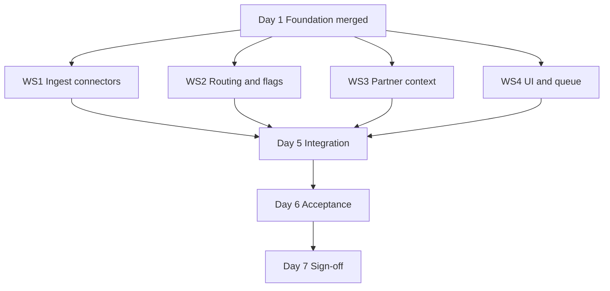

# M1.5 — Primary Military and Maritime Sources

**Milestone:** M1.5 — Primary Military and Maritime Sources  
**Document version:** 3.1 — Cursor-accelerated delivery (full business requirements)  
**Date:** 14 July 2026  
**Status:** Proposal — pending owner sign-off  
**Calendar:** **7 days** (full M1.5 core scope)  
**Traditional estimate:** 21–27 dev-days → compressed via Cursor parallel workstreams  
**Precedes:** M2 — Stabilisation backlog  
**Follows:** M1 — Live baseline audit and locked priority order  
**Related:** M1 Audit Pack (`docs/M1-audit-pack.md`)

**Product rule (non-negotiable):** Sources may feed Watches, raise analyst flags, and support evidence packs. Sources must **not** automatically create Spot Reports. Spot Reports remain analyst-led from the Workbench.

---

## Executive summary

This plan delivers the **full original M1.5 core** (Phases 1–3) in **7 calendar days** using **Cursor** for parallel implementation. Scope is **not reduced** — the calendar is compressed by:

1. **Four parallel workstreams** after Day 1 foundation  
2. **Template cloning** from existing ingest modules (`iccPiracy.ts`, `reliefwebReports.ts`, Facebook OSINT queue)  
3. **Cursor Agent** for schema, API, tests, UI, and parser boilerplate  
4. **Fixture-first development** (saved HTML/PDF samples before live fetch)  
5. **Human gates** only where AI cannot substitute: live site validation, production smoke, owner acceptance  

| Package | Traditional | Calendar | Scope |
|---------|-------------|----------|--------|
| **M1.5 core** | 21–27 dev-days | **7 days** | Phases 1–3 (full spec below) |
| **M1.5 imagery add-on** | 10–14 dev-days | Later | Phase 4 — owner API keys required |

**Price:** **$2,400** (full M1.5 core — same as original proposal; calendar compression does not reduce deliverables)

---

## How 21–27 days fits in 7 days

| Factor | Traditional | Cursor-accelerated |
|--------|-------------|-------------------|
| Work style | Sequential phases | **4 parallel tracks** from Day 2 |
| Boilerplate | Hand-written schema, API, tests | **Agent-generated** from repo patterns |
| Connectors | One at a time | **UKMTO + CENTCOM + partners** in parallel |
| UI | After all ingest | **Watch panels + queue** alongside ingest Days 4–5 |
| Parser risk | Discover live early | **Fixtures first**, live validation Day 2–3 |
| Effective output | 1× dev-day per day | **~3–4×** on implementation; **1×** on verification |

**Honest constraint:** Cursor accelerates **writing code**, not **external dependencies**. Site IP blocks, PDF format quirks, and owner imagery keys still consume human time. Days 6–7 include buffer for this.

**Daily commitment assumed:** 8–10 focused hours with Cursor Agent; CI green each night.

---

## Milestone placement

| Order | Milestone | Calendar | Cost |
|-------|-----------|----------|------|
| — | M1 — Audit | Complete | $250 |
| **→** | **M1.5 — Military & maritime (full core)** | **7 days** | **$2,400** |
| | M2 — Stabilisation | 10–14 days | $1,000 |
| | M3–M6 | Per Phase 2 Proposal | — |
| Optional | M1.5 Phase 4 — Imagery | 10–14 days | $1,000 |

---

## Business requirements summary

### Source group

Add source group **Primary Military and Maritime Sources** covering:

| Source | Role | Default watch |
|--------|------|---------------|
| **CENTCOM** | Official US military releases | Conflict Watch |
| **UKMTO** | Main maritime incident source (warnings, advisories, PDFs) | Shipping Watch |
| **UKMTO partner products** (JMIC, CMF, etc.) | Context and threat-level updates — **not incident reports** | Context panels on watches |
| **Maxar / Planet** | Paid imagery and evidence layer only (Phase 4) | Evidence layer — no auto watch updates |

### Main rule (non-negotiable)

| Allowed | Not allowed |
|---------|-------------|
| Feed Watches | Auto-create Spot Reports |
| Raise analyst flags | Auto-create drafts, PDFs, or customer alerts |
| Support evidence packs | Auto-update Watches from imagery (unless analyst attaches) |
| Surface Possible Spot Report for manual review | Any ingest path writing to `spot_reports` |

Spot Reports remain **analyst-led from the Workbench**.

---

## Full scope — Phases 1–3 (unchanged)

### Phase 1 — Foundation, flags, and routing (Day 1)

| # | Deliverable |
|---|-------------|
| P1-D1 | Source group **Primary Military and Maritime Sources** in Source Health |
| P1-D2 | Five persisted analyst flags: Significant incident, Escalation indicator, Maritime disruption, Evidence available, Possible Spot Report |
| P1-D3 | Dual-watch routing — primary topic + `watch_tags` (or equivalent) |
| P1-D4 | Trigger-term classifiers per Appendix E (CENTCOM, UKMTO, partners) |
| P1-D5 | Spot Report guard — CI test; no ingest path writes `spot_reports` |
| P1-D6 | Routing rules engine (product routing matrix + partner content routing) |

### Phase 2 — CENTCOM and UKMTO live ingest (Days 2–4)

**CENTCOM** (official military source): pull from the CENTCOM public releases index and individual release pages. Capture title, published date, source URL, body text, images (if present), region tags, and category. **Conflict Watch by default.** Tag for Shipping Watch **only** when the release directly mentions vessels, shipping lanes, ports, tankers, maritime traffic, the Red Sea, Gulf of Oman, or Strait of Hormuz. Apply Conflict trigger terms per [Appendix E](#appendix-e--trigger-term-lists).

**UKMTO** (main maritime incident source): pull warnings, advisories, and **PDF products**. Capture all required fields; confidence defaults **high** (official UKMTO). **Shipping Watch by default.** Tag for Conflict Watch when the incident is linked to a state actor, military activity, Iran, Houthis, US forces, Red Sea escalation, Strait of Hormuz escalation, or wider regional conflict. Apply Shipping and Conflict trigger terms per Appendix E. Dedupe vs news echo.

**Watch integration:** Conflict panel (CENTCOM); Shipping panel (UKMTO); evidence URLs on watch items for evidence-pack support.

### Phase 3 — Partner products and analyst queue (Days 4–5)

**Partners:** ingest UKMTO partner products (JMIC, CMF, and other maritime advisory PDFs). Treat as **context and threat-level updates, not incident reports** — partner rows must not increment confirmed incident counts. Context table; threat level extraction; routing per content type (see [Partner content routing](#partner-content-routing)).

**Analyst queue:** unified flag queue; Possible Spot Report → manual create with prefill only (no draft, PDF, or customer alert); flag KPIs.

**Evidence packs:** CENTCOM release URLs, UKMTO advisory/PDF URLs, and (Phase 4) licensed imagery may be attached to incidents and assessments as evidence.

### Phase 4 — Imagery (deferred — full spec in Appendix F)

Maxar and Planet are **not normal news feeds**. They are a paid imagery and evidence layer only. **Not in the 7-day window** (owner API keys + licence workflow). Priced separately at **$1,000**.

- Must **not** create incidents or update Watches automatically
- Watches update from imagery **only when an analyst attaches** imagery to a specific incident or assessment
- Imagery cannot be published without licence metadata and credit line present
- Full field spec, use cases, and acceptance criteria: [Appendix F](#appendix-f--phase-4-imagery-spec)

---

## Parallel workstreams (Days 2–5)

After Day 1 foundation merges, run four tracks in Cursor (separate Agent chats or Composer sessions per track):



| Workstream | Owner | Cursor clones from | Delivers by |
|------------|-------|-------------------|-------------|
| **WS1 — Connectors** | Dev + Agent | `iccPiracy.ts`, `feedFetch.ts` | Day 4 |
| **WS2 — Routing & flags** | Dev + Agent | `shippingAnalysis.ts`, `conflictAnalysis.ts`, `hormuzStatus.ts` | Day 3 |
| **WS3 — Partner context** | Dev + Agent | `reliefwebReports.ts`, PDF parser lib | Day 5 |
| **WS4 — UI & queue** | Dev + Agent | `Protests.tsx` Facebook queue, `Shipping.tsx`, Conflict monitor | Day 5 |

**Merge rule:** One PR per workstream per day; rebase on `main` each morning. Human resolves conflicts — do not let Agent merge blindly.

---

## 7-day execution plan

### Day 0 (before start — 2 hours, not counted)

| Task | Who | Cursor prompt hint |
|------|-----|-------------------|
| Save HTML fixtures | Human | Download UKMTO listing, 2 advisories, CENTCOM releases index, 2 releases → `__tests__/fixtures/m15/` |
| Save 1 partner PDF sample | Human | JMIC or CMF PDF if publicly available |
| Confirm prod URL access | Human | `curl` UKMTO + CENTCOM from Replit shell |
| Create branch `m15/foundation` | Human | — |

### Day 1 — Foundation (all tracks blocked until merged)

| Block | Cursor Agent task | Human gate |
|-------|-------------------|------------|
| AM | Schema: official sources table(s), `watch_tags`, analyst flags columns; Drizzle migration | Review migration |
| AM | Register source group in `integrationStatus.ts`, `maritimeSources.ts`, ingest runner hooks | — |
| PM | Routing rules module + trigger-term config JSON per Appendix E | Review term lists vs client spec |
| PM | Spot Report guard test; OpenAPI + Zod stubs for new endpoints | CI green |
| EOD | **Merge foundation** — unblocks WS1–WS4 | — |

**Day 1 Agent instruction (paste into Cursor):**

> Implement M1.5 Phase 1 foundation per `docs/M1_5/primary-military-maritime-sources-phases.md`. Clone patterns from `iccPiracy.ts` and `socialRaw.ts` (reviewFlag). Add watch_tags, five analyst flags, routing rules engine, trigger-term config per Appendix E, ingest runner registration, Spot Report guard test. Do not implement connectors yet.

### Day 2 — Connectors against fixtures

| WS1 | WS2 | Human |
|-----|-----|-------|
| `ukmtoIngest.ts` — listing + HTML detail parser using fixtures | Wire classifiers to routing engine | Validate parsers against **live** URLs; save updated fixtures if DOM differs |
| `centcomIngest.ts` — listing + detail parser using fixtures | Flag assignment functions at ingest | Run dry-run CLI |

**Day 2 Agent instruction (WS1):**

> Add `lib/ingest/src/ukmtoIngest.ts` and `centcomIngest.ts`. Use `feedFetch.ts` and `iccPiracy.ts` patterns. Parse fixtures in `__tests__/fixtures/m15/`. Extract all required fields from the M1.5 spec. Record Source Health. Never write to spot_reports.

### Day 3 — Persist, dedupe, live ingest

| WS1 | WS2 | WS4 (start) |
|-----|-----|-------------|
| UKMTO + CENTCOM commit mode; URL dedupe; news dedupe hook | Dual-watch tags on insert | Scaffold analyst queue page/panel (read-only list first) |
| PDF text extraction for UKMTO PDFs (if linked from HTML) | Tests with fixtures | — |
| Integration tests per connector | — | Human: manual `POST /api/admin/ingest` |

### Day 4 — Partner products + Watch panels

| WS3 | WS4 | WS1 |
|-----|-----|-----|
| `maritimePartnerProducts.ts` + context table | Shipping Watch — UKMTO official section | Image URL capture on CENTCOM releases |
| JMIC/CMF discovery + PDF summary extract | Conflict Watch — CENTCOM section | — |
| Threat level regex | Flag badges on watch items | — |

### Day 5 — Analyst queue + integration

| WS4 | All |
|-----|-----|
| Unified flag queue (filter by flag type) | Wire full ingest chain in `ingestRunner.ts` |
| Possible Spot Report → `/spot-reports/new?incidentId=` only | Partner context panels on watches |
| Flag KPIs | E2E: ingest → DB → API → UI |

**Human gate Day 5:** Walk [US–Iran / Hormuz example](#usiran--strait-of-hormuz-example) — CENTCOM + UKMTO + partner item on correct watches with correct product roles.

### Day 6 — Acceptance and hardening

| Task | Who |
|------|-----|
| Run all M1.5-T1–T16 acceptance tests | Agent fixes failures in loop |
| Production smoke ingest | Human |
| Source Health truth table update | Agent drafts; human reviews |
| Bugfix only — **no new scope** | — |

### Day 7 — Sign-off

| Task | Who |
|------|-----|
| Owner acceptance walkthrough (or async video) | Human |
| Appendix D sign-off | Owner |
| Handoff note: known thin areas, Phase 4 imagery | Agent drafts |
| **M2 may start** | — |

---

## Cursor playbook

### What Cursor Agent should do

| Task type | Delegate to Agent |
|-----------|-------------------|
| New ingest module from template | Yes |
| Drizzle schema + migration | Yes |
| OpenAPI + route + Zod | Yes |
| Unit tests from fixtures | Yes |
| Watch UI panels (copy existing layout) | Yes |
| Analyst queue (clone Facebook OSINT panel) | Yes |
| Routing rules + flag assignment | Yes |
| CI failure triage | Yes |

### What the human must do

| Task | Why |
|------|-----|
| Save live HTML/PDF fixtures Day 0 | Agent cannot browse UKMTO/CENTCOM reliably |
| Live URL validation Day 2–3 | DOM and network truth |
| Production ingest smoke | Secrets, IP, scheduler |
| Review migrations & routing terms | Product correctness |
| Merge conflict resolution | Agent context limits |
| Owner demo / sign-off | Commercial acceptance |
| Whitelist Replit IP if blocked | External dependency |
| Review trigger terms (Appendix E) vs live content | Product correctness |

### Recommended Cursor setup

| Setting | Recommendation |
|---------|----------------|
| Model | Default Agent model; use fast model for test-fix loops |
| Rules | Add `.cursor/rules/m15.mdc` pointing to this doc + Spot Report guard + Appendix E trigger terms |
| Context | `@iccPiracy.ts` `@reliefwebReports.ts` `@facebookOsint.ts` in every ingest/queue task |
| Tests | Ask Agent to run `pnpm test` / targeted `jest` after each workstream |
| Parallelism | **Separate chat per workstream** — avoids context collision |

### Agent guardrails (add to every prompt)

```
M1.5 GUARDRAILS:
- Never insert into spot_reports from ingest
- Official sources must not inflate wrong incident counts (use dedicated tables where specified)
- Partner products are context/threat-level — not incident reports
- Clone iccPiracy / reliefwebReports patterns for standalone storage
- recordSourceHealth on every connector
- Imagery (Phase 4): no publish without licence metadata + credit line; no auto watch updates
- Match existing repo conventions (pnpm, Drizzle, OpenAPI-first)
```

---

## Source group — full field spec

### CENTCOM (official military source)

Pull from the CENTCOM public releases page and individual release pages.

| Field | Required |
|-------|----------|
| Title | Yes |
| Published date | Yes |
| Source URL | Yes |
| Body text | Yes |
| Images | Useful if present |
| Region tags | Middle East, Iran, Iraq, Syria, Yemen, Red Sea, Gulf, Strait of Hormuz |
| Category | conflict, military, escalation |

**Default routing:** Conflict Watch.

**Conflict Watch triggers** — tag when release mentions any term in [CENTCOM Conflict list](#centcom--conflict-watch-triggers) (Appendix E).

**Shipping Watch triggers** — tag **only** when release **directly** mentions vessels, shipping lanes, ports, tankers, maritime traffic, the Red Sea, Gulf of Oman, or Strait of Hormuz ([CENTCOM Shipping list](#centcom--shipping-watch-triggers), Appendix E). Do not tag Shipping for general military content without explicit maritime reference.

### UKMTO (main maritime incident source)

Pull from UKMTO warnings, advisories, and PDF products.

| Field | Required |
|-------|----------|
| Warning / advisory number | Yes |
| Date and time | Yes |
| Location text | Yes |
| Coordinates | If shown |
| Vessel type | Yes |
| Incident type | Yes |
| Reported impact | Yes |
| Source URL or PDF URL | Yes |
| Confidence | High (official UKMTO default) |

**Default routing:** Shipping Watch.

**Shipping Watch triggers** — tag when content mentions any term in [UKMTO Shipping list](#ukmto--shipping-watch-triggers) (Appendix E).

**Conflict Watch triggers** — additionally tag when incident is linked to a state actor, military activity, Iran, Houthis, US forces, Red Sea escalation, Strait of Hormuz escalation, or wider regional conflict ([UKMTO Conflict list](#ukmto--conflict-watch-triggers), Appendix E).

### Partner products (JMIC, CMF, etc.)

UKMTO partner maritime advisory PDFs. **Context and threat-level updates — not incident reports.**

| Field | Required |
|-------|----------|
| Product title | Yes |
| Provider | Yes |
| Date | Yes |
| Region | Yes |
| Threat level | Yes if stated |
| Summary | Yes |
| Source URL or PDF URL | Yes |

**Routing:** per [Partner content routing](#partner-content-routing) below. Partner rows must not increment confirmed incident counts.

### Maxar / Planet (Phase 4 — evidence layer only)

Not a news feed. Paid imagery requested by analysts. Full spec: [Appendix F](#appendix-f--phase-4-imagery-spec). Must not create incidents or auto-update Watches.

---

## Trigger-term classifiers

Canonical term lists for implementation (`lib/ingest/config/m15-trigger-terms.json` or equivalent). See [Appendix E](#appendix-e--trigger-term-lists) for the full reference.

| Source | Classifier | Applies when |
|--------|------------|--------------|
| CENTCOM | Conflict | Any Conflict trigger term match → Conflict Watch |
| CENTCOM | Shipping | Direct maritime term match only → add Shipping Watch |
| UKMTO | Shipping | Any Shipping trigger term match → Shipping Watch (default) |
| UKMTO | Conflict | Escalation / state-actor term match → add Conflict Watch |
| Partners | Content type | Regex / keyword routing per partner content table |

---

## Partner content routing

| Content type | Routing | Notes |
|--------------|---------|-------|
| Maritime threat level raised | Shipping Watch **context** | Threat-level panel update |
| Strait of Hormuz warning | Shipping Watch | Maritime route risk |
| Red Sea / Gulf military escalation | Shipping Watch + Conflict Watch **context** | Dual context panels |
| JMIC / CMF escalation advisory | Shipping Watch + Conflict Watch **context** | Escalation framing |
| General best-practice guidance | **Context only** | No watch item inflation |
| Advisory with no incident | **Watch context only** | Background threat posture |

---

## Product routing matrix

| Source / trigger | Product |
|------------------|---------|
| CENTCOM military release | Conflict Watch |
| CENTCOM release mentioning vessels, shipping lanes, ports, tankers, maritime traffic, Red Sea, Gulf of Oman, or Strait of Hormuz | Conflict Watch + Shipping Watch |
| UKMTO warning or advisory | Shipping Watch |
| UKMTO incident linked to Iran, Houthis, state actor, military activity, US forces, or regional escalation | Shipping Watch + Conflict Watch |
| UKMTO partner threat-level update | Shipping Watch context |
| JMIC / CMF escalation advisory | Shipping Watch + Conflict Watch context |
| Partner general guidance / non-incident advisory | Watch context only (no incident row) |
| Maxar / Planet imagery | Evidence layer only (Phase 4) |
| Analyst-selected imagery | Manual attach to report or watch item (Phase 4) |

---

## US–Iran / Strait of Hormuz example

Reference scenario for Day 5 walkthrough and M1.5-T15 acceptance.

| Product | Role in Hormuz scenario |
|---------|-------------------------|
| **Conflict Watch** | Main home for US–Iran escalation — CENTCOM releases on strikes, IRGC, retaliation, US forces, regional military activity |
| **Shipping Watch** | Maritime disruption — UKMTO warnings on tanker strikes, vessel hits, Hormuz transit impact, port/route disruption, insurance and routing context |
| **Evidence layer** | CENTCOM release URLs, UKMTO advisories/PDFs, licensed Maxar/Planet imagery (Phase 4) attached to incidents or assessments |
| **Spot Report** | Created **manually by analyst only** — Possible Spot Report flag may prefill editor; no auto-create |

**Expected ingest → watch flow:**

1. CENTCOM release on US strikes / Iran → Conflict Watch item; Shipping Watch **only if** maritime terms present
2. UKMTO advisory on tanker incident near Hormuz → Shipping Watch; Conflict Watch if Houthis/Iran/military escalation terms match
3. JMIC/CMF threat-level or escalation PDF → context panels on relevant watches; no incident count inflation
4. Analyst reviews flagged items; creates Spot Report from Workbench if warranted

---

## Analyst flags

| Flag | Meaning | Auto Spot Report? |
|------|---------|-------------------|
| Significant incident | Worth analyst review | No |
| Escalation indicator | May affect Conflict Watch | No |
| Maritime disruption | May affect Shipping Watch | No |
| Evidence available | Official source or licensed imagery available | No |
| Possible Spot Report | Analyst should review; surface for manual action | **No** |

**Possible Spot Report:** queue action opens Spot Report editor with prefill (`/spot-reports/new?incidentId=`). No row created until analyst saves. Must **not** generate a report, draft, PDF, or customer alert automatically.

---

## Acceptance criteria (full M1.5 core)

| # | Criterion | Pass test |
|---|-----------|-----------|
| M1.5-T1 | Phase 1 | Source group visible; five flags persist; dual routing on fixture; Spot Report guard passes |
| M1.5-T2 | CENTCOM live | Ingest ≥1 release; all required fields |
| M1.5-T3 | CENTCOM routing | Military → Conflict; direct maritime terms (vessels, ports, tankers, Red Sea, Gulf of Oman, Hormuz, etc.) → both watches |
| M1.5-T4 | UKMTO live | Ingest ≥1 warning; number, datetime, location, URL |
| M1.5-T5 | UKMTO PDF | If PDF linked, text extracted; fields populated or gracefully partial |
| M1.5-T6 | UKMTO routing | Vessel incident → Shipping; state-actor / escalation terms → both watches |
| M1.5-T7 | Dedupe | Re-ingest does not duplicate official URLs or news echoes |
| M1.5-T8 | Source Health | CENTCOM + UKMTO `live` after successful run |
| M1.5-T9 | Partner ingest | ≥1 JMIC/CMF product with title, provider, date, summary |
| M1.5-T10 | Partner routing | Threat level → Shipping context; escalation → both watches; general guidance → context only |
| M1.5-T11 | No incident inflation | Partner rows do not increment confirmed incident counts |
| M1.5-T12 | Analyst queue | Flagged items filterable; KPIs visible |
| M1.5-T13 | Possible Spot Report | Opens manual create only; zero auto `spot_reports`; no draft, PDF, or customer alert |
| M1.5-T14 | Watch UI | Official CENTCOM + UKMTO sections on Conflict / Shipping |
| M1.5-T15 | Hormuz example | Per [US–Iran / Hormuz example](#usiran--strait-of-hormuz-example): CENTCOM → Conflict; UKMTO incident → Shipping (+ Conflict if escalation); partner → context panels; Spot Report manual only |
| M1.5-T16 | Evidence support | CENTCOM and UKMTO source/PDF URLs available on watch items for evidence-pack attachment |

### Phase 4 acceptance (imagery add-on — when funded)

| # | Criterion | Pass test |
|---|-----------|-----------|
| M1.5-P4-T1 | No auto incidents | Imagery ingest creates zero incident rows |
| M1.5-P4-T2 | Analyst attach only | Watch updates from imagery only after analyst attaches to incident/assessment |
| M1.5-P4-T3 | Publish gate | Imagery blocked from publish without licence metadata + credit line |
| M1.5-P4-T4 | Required fields | Provider, image date, grid/location, licence terms, credit line, analyst note captured |
| M1.5-P4-T5 | Use cases | Analyst can request/attach imagery for port, strike, vessel, before/after, damage assessment, map image, evidence pack |

---

## Fallback plan (if blocked mid-week)

If live fetch fails by end of Day 3:

| Priority | Ship | Defer |
|----------|------|-------|
| 1 | Foundation + flags + queue + Spot Report guard | — |
| 2 | CENTCOM on fixtures + manual admin promote of saved HTML | Live poll until IP fixed |
| 3 | UKMTO HTML warnings | UKMTO PDF + partners |
| 4 | — | Phase 4 imagery |

Document blockers in Source Health; do not mark `failing` for unavailable upstream.

---

## Relationship to M2

| M2 item | M1.5 interaction |
|---------|------------------|
| B1–B4 | M1.5 adds rows; M2 aligns full truth table |
| B6 | M1.5 connectors use `recordSourceHealth` |
| B10 | M1.5 extends integration tests |

M2 starts after M1.5 Day 7 sign-off (or parallel on B5/B7 if agreed).

---

## Risks

| Risk | Mitigation |
|------|------------|
| Agent merges conflicting PRs | One workstream per branch; human merge |
| Parser wrong on live DOM | Fixtures Day 0; live check Day 2 |
| 7-day slip | Fallback table above; imagery always deferred |
| Scope creep in Agent chats | Reference this doc; change request = post-M1.5 |
| PDF parsing fragile | Best-effort + summary from first page; improve in M2 |

---

## Definition of done

- [ ] Phases 1–3 deliverables complete
- [ ] M1.5-T1 through M1.5-T16 pass
- [ ] Trigger-term classifiers match Appendix E
- [ ] Partner context-only routing per partner content routing table
- [ ] No ingest path creates Spot Reports, drafts, PDFs, or customer alerts
- [ ] Evidence URLs available on watch items (M1.5-T16)
- [ ] CI / typecheck green
- [ ] Owner Appendix D signed
- [ ] Phase 4 imagery spec (Appendix F) agreed; implementation when funded

---

## Appendix A — Pricing

| Package | Traditional | Calendar | Price |
|---------|-------------|----------|-------|
| **M1.5 core** (Phases 1–3) | 21–27 dev-days | **7 days** | **$2,400** |
| M1.5 Phase 4 imagery | 10–14 dev-days | TBD | $1,000 |

---

## Appendix B — Reuse map

| Component | M1.5 use |
|-----------|----------|
| `iccPiracy.ts` | UKMTO / official maritime storage |
| `reliefwebReports.ts` | Partner product context |
| `facebookOsint.ts` + `Protests.tsx` | Analyst review queue |
| `shippingAnalysis.ts` / `conflictAnalysis.ts` | Trigger terms |
| `hormuzStatus.ts` | Hormuz escalation |
| `maritimeSources.ts` | UKMTO health slot |
| `SpotReportEditor.tsx` | Possible Spot Report prefill |
| Evidence pack attachment | CENTCOM / UKMTO URLs on watch items |

---

## Appendix C — Cursor task checklist (printable)

| Day | WS1 | WS2 | WS3 | WS4 | Human |
|-----|-----|-----|-----|-----|-------|
| 0 | — | — | — | — | Fixtures + URL check |
| 1 | — | Foundation | — | — | Merge foundation |
| 2 | Parsers | Classifiers | — | — | Live DOM check |
| 3 | Persist + PDF | Tags + flags | — | Queue scaffold | Prod ingest |
| 4 | Images | — | Partners | Watch panels | — |
| 5 | — | E2E routing | Partner UI | Queue complete | Hormuz walkthrough |
| 6 | — | — | — | — | Acceptance + smoke |
| 7 | — | — | — | — | Sign-off |

---

## Appendix D — Owner sign-off

### D.1 Scope acceptance

| Criterion | Met? |
|-----------|------|
| Full M1.5 core (Phases 1–3) in **7 calendar days** | |
| Cursor-accelerated delivery; scope not reduced | |
| All business requirements in this document (v3.1) | |
| Trigger terms per Appendix E | |
| Partner context-only routing per partner content routing table | |
| Phase 4 imagery spec agreed (Appendix F); implementation deferred ($1,000 add-on) | |
| Spot Reports analyst-led; no auto-create, draft, PDF, or alert | |
| Evidence packs supported via source URLs on watch items | |
| M2 still required after M1.5 | |
| Budget **$2,400** agreed | |
| Owner provides URL access / IP whitelist if needed | |

### D.2 Sign-off

| Role | Name | Signature | Date |
|------|------|-----------|------|
| Owner | | | |
| Developer | Tommy To | | |

---

## Appendix E — Trigger term lists

Canonical lists for `lib/ingest/config/m15-trigger-terms.json` (or equivalent). Matching is case-insensitive; use word-boundary or phrase matching where practical.

### CENTCOM — Conflict Watch triggers

Tag for **Conflict Watch** when any term appears in title or body:

| Term |
|------|
| US strikes |
| Iran |
| IRGC |
| Houthis |
| missiles |
| drones |
| air defence |
| military facilities |
| retaliation |
| US forces |
| Gulf |
| Red Sea |
| Strait of Hormuz |

**Default:** all CENTCOM military releases route to Conflict Watch. Terms above drive **Escalation indicator** flag assignment and region tagging.

### CENTCOM — Shipping Watch triggers

Tag for **Shipping Watch** only when the release **directly** mentions maritime operations (not general Gulf/Red Sea military activity alone):

| Term |
|------|
| vessels |
| shipping lanes |
| ports |
| tankers |
| maritime traffic |
| Red Sea (in maritime/shipping context) |
| Gulf of Oman |
| Strait of Hormuz (in maritime/transit context) |

### UKMTO — Shipping Watch triggers

Tag for **Shipping Watch** (default for all UKMTO warnings/advisories; terms below drive **Maritime disruption** flag):

| Term |
|------|
| vessel hit |
| tanker |
| boarding |
| attack |
| fire |
| missile |
| drone |
| hijack |
| detention |
| mine |
| suspicious approach |
| warning shots |
| port disruption |
| route disruption |

### UKMTO — Conflict Watch triggers

Additionally tag for **Conflict Watch** when incident is linked to escalation or state/military actors:

| Term / condition |
|------------------|
| state actor |
| military activity |
| Iran |
| Houthis |
| US forces |
| Red Sea escalation |
| Strait of Hormuz escalation |
| wider regional conflict |

---

## Appendix F — Phase 4 imagery spec

Maxar and Planet are a **paid imagery and evidence layer**. Implementation deferred until owner provides API keys and licence workflow. Business rules apply regardless of delivery calendar.

### Behaviour rules

| Rule | Requirement |
|------|-------------|
| Not a news feed | No polling treated as incident ingest |
| No auto incidents | Imagery ingest must not create incident rows |
| No auto watch updates | Watches update only when analyst attaches imagery to incident or assessment |
| Publish gate | **Block publish** unless licence metadata **and** credit line are present |
| Analyst-led | Imagery requested and attached by analyst |

### Use cases

Analyst requests imagery for:

| Use case |
|----------|
| Port or pier location |
| Strike location |
| Vessel location |
| Before and after imagery |
| Damage assessment |
| Map image for report |
| Evidence pack |

### Field spec

| Field | Required |
|-------|----------|
| Provider | Yes — Maxar or Planet |
| Image date | Yes |
| Grid or location | Yes |
| Licence terms | Yes |
| Credit line | Yes |
| Thumbnail | Useful |
| Full image link | If licensed |
| Analyst note | Yes |

### Routing

| Source / action | Product |
|-----------------|---------|
| Maxar / Planet imagery (ingested) | Evidence layer only |
| Analyst attaches imagery to incident | Evidence on incident + optional watch context |
| Analyst attaches imagery to assessment/report | Evidence pack |

---

*End of M1.5 plan (v3.1). Full business requirements captured. Phases 1–3 delivered in 7 days via Cursor parallel workstreams. Phase 4 imagery spec in Appendix F — implementation when funded.*
